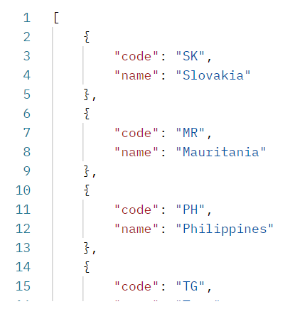
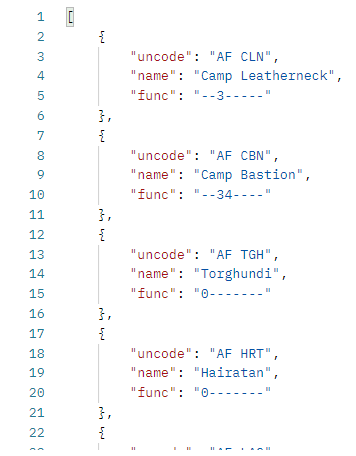

# UN/LOCODE
## Обзор
RESTful API сервис получения международных географических кодов.

### Приложение позволяет получить:
*  список кодов и названий стран в формате json;
*  список кодов страны с тремя полями code, name, func в формате json;

`После запуска сервис позволяет получать данные в чистом виде минуя сайт ЕЭК ООН.`

### Также реализовано:
* работа с Redis;
* модульное тестирование;
* интеграционное тестирование;

### Использованные технологии
* Java 11
* Spring Boot
* Maven
* JUnit 5
* Mockito
* Redis

## Запуск

Склонировать репозиторий, выполнив команду -

`git clone https://github.com/Esthete9/unLocode.git`

Далее перейти в корневую директорию проекта и выполнить команду -

`mvn spring-boot:run`

После запустить Redis в Docker-контейнере командой - 

`docker run --name myredis -p 6379:6379 -d redis`

Для начала работы необходимо загрузить данные с сайта выполнив GET запрос.

Пример - 

`service/load-countries` - загрузит список стран и их кодов,
после можно обращаться к `service/countries` и получить загруженный список в чистом виде минуя сайт ЕЭК ООН.

`service/locode/{code}` - загрузит список кодов страны,
после можно обращаться к `service/locode/{code}` и получить загруженный список в чистом виде.

### Список кодов загружается для каждой страны отдельно.

## Endpoints
`GET service/load-countries`
### Загружает список кодов и названий стран в Redis.
В случае размещения приложения на порте 8080, запрос будет выглядеть:
**localhost:8080/service/load-countries** - все остальные запросы строятся аналогично.

#### Тип возвращаемого значения
`ResponseEntity<HttpStatus>`

#### Ответ:

`OK`

---
`GET service/countries`
### Возвращает список кодов и названий стран.

#### Тип возвращаемого значения
`List<CountryDTO>`

#### Ответ:

 ---

`GET service/load-codes/{code}`

### Загружает список кодов страны с тремя полями code, name, func в Redis.

{code} - код страны, пример -

service/load-codes/AF - загрузит коды Афганистана.

#### Тип возвращаемого значения
`ResponseEntity<HttpStatus>`

#### Ответ:

`OK`

---
`GET service/locode/{code}`
### Возвращает список кодов страны.

#### Тип возвращаемого значения
`List<CodeDTO>`

#### Ответ:

 ---

